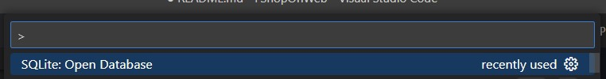
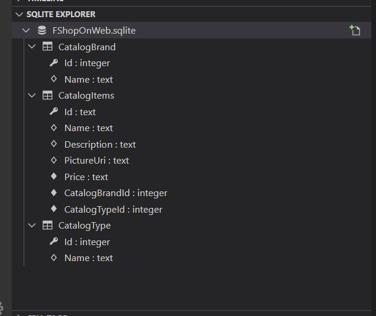

# FShopOnWeb

F# take on eShopOnWeb ASP.NET Core sample application.

## Icons, Banners, and Emotes

### Stats

  
  
  
  

### Contributor Socials

  
    

## Build / Run

### Application

This project requires two steps to run the application successfully. The first step is to run the `npm: start` VS Code task to compile the SCSS styles. This can be done from VS Code by pressing `ctrl+p`, typing `task`, and selecting `npm: run` from the list. This will run `npm install` before executing. The second step is to run the `dotnet: watch` VS Code task by pressing `ctrl+p`, typing `task`, and selecting `dotnet: watch` from the list. This will run the application which can be accessed at `https://localhost:7055`.

An example of getting started can be shown below:

### Database

Once the application starts (in Development mode) it seeds a SQLite database located at `~\App_Data\FShopOnWeb.sqlite`. The database is recreated every time the application starts.

To interact with this database directly, you can install the VS Code [SQLite](https://marketplace.visualstudio.com/items?itemName=alexcvzz.vscode-sqlite) extension and use it to open the database after it is created, using the `SQLite: Open Database` command from the command palette (`ctrl+shift+p`).

This will add the SQLite Explorer tray under the File Explorer where you can initiate SQL queries or explore the database schema.

## Related Projects and Inspiration

- [eShopOnWeb](https://github.com/dotnet-architecture/eShopOnWeb)
- [Clean Architecture](https://github.com/ardalis/CleanArchitecture)
- [Falco](https://github.com/pimbrouwers/Falco)
- [Typescript Functional Extensions](https://github.com/seangwright/typescript-functional-extensions)
